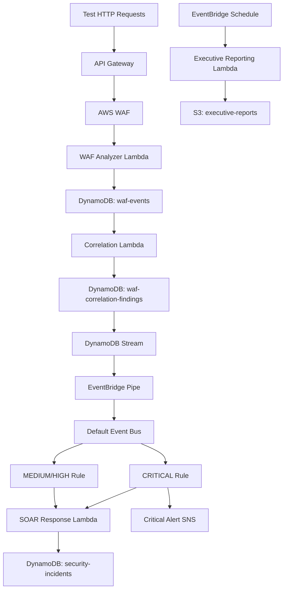

# Event Driven Architecture Diagram

```mermaid
flowchart TD

A[Test HTTP Requests]
--> B[API Gateway]
--> C[AWS WAF]
--> D[WAF Analyzer Lambda]
--> E[DynamoDB: waf-events]
--> F[Correlation Lambda]
--> G[DynamoDB: waf-correlation-findings]
--> H[DynamoDB Stream]
--> I[EventBridge Pipe]
--> J[Default Event Bus]

J --> K[MEDIUM/HIGH Rule]
K --> L[SOAR Response Lambda]

J --> M[CRITICAL Rule]
M --> L
M --> N[Critical Alert SNS]

L --> O[DynamoDB: security-incidents]

P[EventBridge Schedule]
--> Q[Executive Reporting Lambda]
--> R[S3: executive-reports]
```

